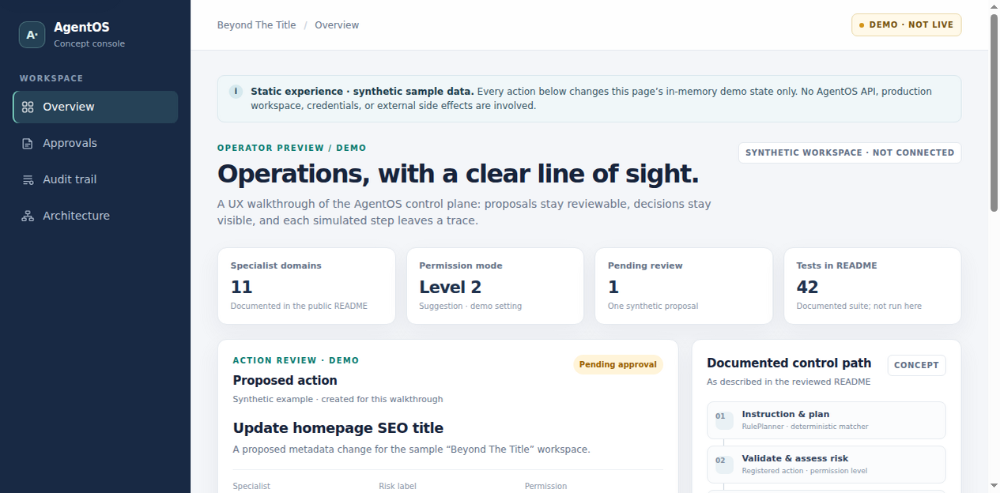

# AgentOS

AgentOS is a **traceable Python architecture prototype** for safety-aware agent orchestration and interoperability. It models a local path from instruction to registered action, risk decision, optional human approval, workspace snapshot, execution, and audit record—patterns relevant to connecting organizational systems and personal agents. This repository demonstrates architecture and practical design patterns; it is **not** a production system, evidence of enterprise deployment, or an implemented end-to-end interoperability solution.

**[Read the architecture overview](docs/architecture-overview.md)** for the flow, source map, test evidence, and limitations.

```text
Instruction -> deterministic rule planner -> registered action
            -> risk / approval gate -> local-workspace dry-run
            -> workspace snapshot -> action -> SQLite audit entry
```

## Separate simulated concept demo

[Open the separately hosted concept demo](https://agentos-concept-demo.invented-yacht.workers.dev/). It is a static-style walkthrough using synthetic, in-memory sample data—not this repository running, an AgentOS backend, or a connected production workspace. Its visible notice says no API, credentials, or external side effects are involved.



*Archived concept-demo screenshot. Its on-screen “42” test count is demo copy from the earlier capture, not the current repository test result. The preview is not evidence that this code is running behind the demo.*

## Run locally

```bash
python -m venv .venv
source .venv/bin/activate
python -m pip install -e ".[dev]"

# Keep prototype data outside the source tree and start read-only.
export AGENTOS_HOME="$(mktemp -d)"
export AGENTOS_PERMISSION_LEVEL=1
unset WEBSITE_API_TOKEN
python -m agentos serve --host 127.0.0.1 --port 8000
```

Open `http://127.0.0.1:8000`. The app has **no authentication**; keep it bound to loopback and do not expose it to a network. `AGENTOS_HOME` contains the local `workspace/`, `snapshots/`, and `agentos.db`.

The application does not automatically load `.env` files. The website connector reads `WEBSITE_API_URL` and `WEBSITE_API_TOKEN` from the process environment when imported. For a local walkthrough, leave the token unset and do not run `content.check_website_connection`: that action makes real HTTP GET requests.

## What is implemented

- `RulePlanner` uses deterministic regular-expression rules; it does not call an LLM. A match generally creates one action step, not autonomous multi-agent delegation.
- Registered action handlers live under [`agentos/agents/`](agentos/agents/). Most examples operate on local files or SQLite. Names such as `deploy`, `change_dns`, and `schedule_post` do not mean a real deployment, DNS provider, or social network is connected.
- [`AgentOS.run_action`](agentos/core/kernel.py) validates parameters and applies the risk policy in [`permissions.py`](agentos/core/permissions.py). Mutating local actions first run against a temporary workspace copy; the workspace is then snapshotted before the local handler runs. Snapshots do not roll back SQLite or remote services.
- Approval requests, memory, conversations, and audit entries are stored in SQLite. Audit entries are append-only through the application interface, not tamper-proof or cryptographically immutable.
- [`website_api.py`](agentos/connectors/website_api.py) provides one narrow website connector. `content.check_website_connection` sends real GET requests. `content.publish_to_website` can send a real POST only after explicit approval and with a configured token. Its dry-run exits before the connector makes a network request. The `update_post()` helper is not exposed as a registered AgentOS action.

The local `content.publish` action only moves a Markdown draft into the prototype workspace's `content/published/` folder. Remote publication is the separate `content.publish_to_website` action, classified as **critical and non-reversible**, so it always requires approval, including at permission level 4.

## Permission levels

`AGENTOS_PERMISSION_LEVEL` accepts `1` through `4`:

| Level | Name | Implemented behavior |
| --- | --- | --- |
| 1 | `READ_ONLY` | Mutating actions are denied; read-only actions can run. |
| 2 | `SUGGESTION` | Mutating actions require approval. |
| 3 | `SAFE_AUTOMATION` | Low-risk reversible actions can execute; medium, critical, and non-reversible work requires approval. |
| 4 | `CRITICAL_OPERATIONS` | Medium-risk reversible actions can execute; critical and non-reversible work still requires approval. |

This is a prototype policy gate, not authenticated authorization. The API has no user authentication or access-control layer, including on approval and permission-setting endpoints.

## Interfaces

The FastAPI application is in [`agentos/api/app.py`](agentos/api/app.py); request schemas are in [`agentos/api/schemas.py`](agentos/api/schemas.py); the CLI is in [`agentos/cli.py`](agentos/cli.py).

Implemented API surfaces include chat, action inventory/run, approvals, audit, snapshots/rollback, emergency stop, permission level, and memory. These are local prototype endpoints, not a secured public API.

```bash
python -m agentos status
python -m agentos actions
python -m agentos approvals
python -m agentos audit --limit 10
```

## Not implemented

- Production hardening, authentication, tenant isolation, verified authorization identity, secrets management, or deployment guidance.
- LLM-backed planning, general task reasoning, resilient autonomous execution, or end-to-end delegation among specialist agents.
- End-to-end interoperability across company AI systems and personal agents: there is no shared protocol, identity model, conformance suite, or partner integration.
- Real CMS, DNS, analytics, social, support, deployment, or migration integrations beyond the narrow website connector described above; most related actions are local examples.
- Transactions, robust retry/idempotency guarantees, or rollback across remote systems.

## Quality checks

GitHub Actions is configured to run these checks on Python 3.11 for pushes to `main`, pull requests, and manual dispatch:

```bash
python -m pytest -q
python -m ruff check .
python -m ruff format --check .
python -m mypy agentos
```

Local verification on Python 3.11: **46 tests passed**, Ruff lint passed, Ruff formatting check passed (45 files), and mypy reported no issues in 36 source files. The tests stub or block the website HTTP boundary; they do not contact a live website. These checks support the tested local prototype only—they are not production-security or interoperability validation. Dependency versions are range-based rather than fully locked.

## Author and identity references

These links are provided for author and organization identification, not as endorsements:

- Author: [Rashik — Beyond The Title](https://jarifurrahim.one/)
- [LinkedIn profile](https://www.linkedin.com/in/jarifurrahim)
- [Google Knowledge Panel search URL (provided by the author)](https://www.google.com/search?kgmid=/g/11z1lszj5x)
- Organization: [Rashik — The Awakening](https://rashik.org/) (official domain supplied by the author)
